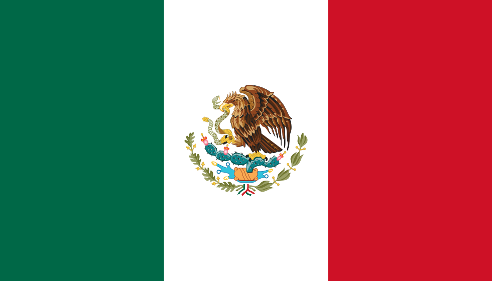
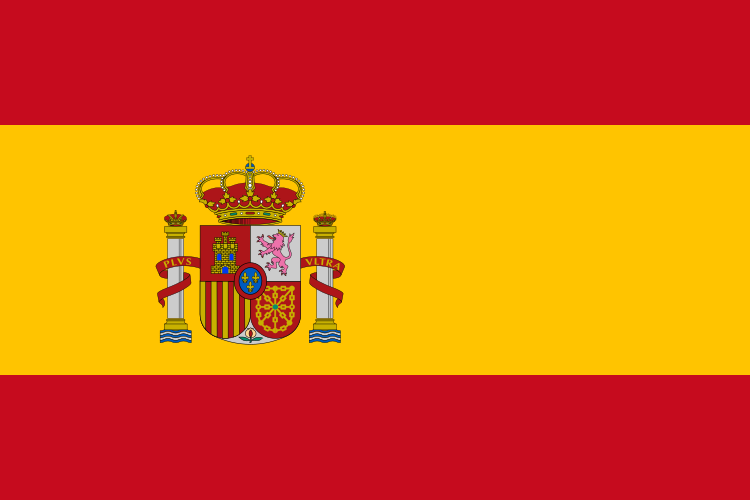

## Becas recientes

  <a href="#guatemala">Guatemala</a>
  <a href="#japon">Japón</a>
  <a href="#mexico">México</a>
  <a href="#tailandia">Tailandia</a>
  <a href="#corea">Corea</a>
  <a href="#chile">Chile</a>
  <a href="#espana">España</a>
  <a href="#colombia">Colombia</a>

### Beca de Estudio en el Extranjero
Una excelente oportunidad para estudiar en el extranjero con todos los gastos cubiertos.

### Beca Nacional de Investigación
Apoyo económico para estudiantes universitarios que deseen realizar investigaciones en Guatemala.

### Guatemala
Próximamente encontrarás becas disponibles en Guatemala.

### Japón
Próximamente encontrarás becas disponibles en Japón.

### México
Próximamente encontrarás becas disponibles en México.

### Tailandia
Próximamente encontrarás becas disponibles en Tailandia.

### Corea
Próximamente encontrarás becas disponibles en Corea.

### Chile
Próximamente encontrarás becas disponibles en Chile.

### España
Próximamente encontrarás becas disponibles en España.

### Colombia
Próximamente encontrarás becas disponibles en Colombia.

## Contacto
Si deseas colaborar con "El Becatorio" o tienes alguna consulta, escríbenos a [info@becatorio.com](mailto:info@becatorio.com).
